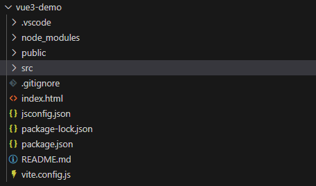

# Vue3基础
## 使用Vite创建Vue3项目

### 创建指令

```
npm create vue@latest
```

需要的选项

```
✔ Project name: … <your-project-name>  ## 你要创建的名称
✔ Add TypeScript? … No / Yes    ## 是否支持ts
✔ Add JSX Support? … No / Yes   ## 是否支持JSX
✔ Add Vue Router for Single Page Application development? … No / Yes  ## 是否添加路由
✔ Add Pinia for state management? … No / Yes  ## 是否添加Pinia状态管理库
✔ Add Vitest for Unit testing? … No / Yes  ## 是否添加单元测试
✔ Add an End-to-End Testing Solution? … No / Cypress / Nightwatch / Playwright  ## 是否添加添加端到端测试
✔ Add ESLint for code quality? … No / Yes  ## 是否添加代码规范
✔ Add Prettier for code formatting? … No / Yes ## 是否添加代码格式化
✔ Add Vue DevTools 7 extension for debugging? (experimental) … No / Yes  ## 是否添加开发工具

Scaffolding project in ./<your-project-name>...
Done.
```

说明：
**1. JSX (JavaScript XML) 是一种 JavaScript 的语法扩展，主要用于 React 框架中描述用户界面。**
**2. Pinia 是一个轻量级的状态管理库，用于在 Vue 应用中集中管理全局状态。**

### 项目的目录结构


说明：
1. .vscode: 针对vscode推荐的插件，当你未安装时，vscode会提醒你安装vue官方的插件
2. public： 里面是浏览器上方显示的图标
3. src： 主要项目开发内容
4. .gitignore: git的忽略文件配置
5. index.html: 入口文件
6. package-lock.json,package.json: 包管理文件
7. vite.config.js: vite的配置文件